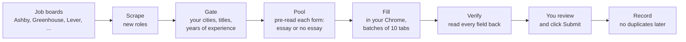

# OpenApply

**A job-application agent that runs inside Claude Code.**
It finds roles that fit you, fills the application forms in your own Chrome, and stops for your review before Submit.

You fill in one file about yourself.
The agent does the searching, the screening, and the form filling.
You read what it wrote and click Submit.

One real run of this loop sent about 100 applications in two working days.
The rules in this repo come from that run.

## How it works



1. **Scrape.** It reads about 350 public job boards (you can add more) and stores every open role on your machine.
2. **Gate.** It keeps only roles in your cities, with your titles, under your years-of-experience limit.
3. **Pool.** Before it opens a tab, it reads each application form through the job board's API and sorts it: forms with essay questions go to you, plain forms go to the fast lane.
4. **Fill.** It opens each form in your Chrome and fills it from your profile. Essay answers come from your own approved answers, with the company name swapped in.
5. **Verify.** It reads every field back and checks it against your profile. A wrong answer blocks the form.
6. **Submit.** You review each tab and click Submit.
7. **Record.** It logs every application, so it never applies to the same role twice and respects per-company limits.

## Quickstart

You need about 30 minutes for the first setup.

1. Clone this repository and open a terminal in it.
2. Run `npm install`.
3. Run `npm run doctor`. It tells you what is missing.
4. Install the [Claude in Chrome](https://chromewebstore.google.com/detail/fcoeoabgfenejglbffodgkkbkcdhcgfn) extension and sign in.
5. Open Claude Code in this folder and say:

   > read AGENTS.md

The agent takes it from there.
It asks for your CV, asks you a few questions, and writes your profile.
Then it loads the job boards, finds roles, and does a practice fill on one real form without submitting it.

After setup, start each session with "read AGENTS.md" and then "run the loop".

## What you provide

| What | Where | How |
|---|---|---|
| Your facts: contact details, work authorization, cities, target titles, limits | `profile.md` | The agent interviews you and writes it. See `profile.example.md`. |
| Your CV | `cv/cv.tex` | Upload your CV. The agent rebuilds it in a clean, ATS-safe LaTeX template and checks it. |
| Two or three answers in your own words | `answers/` | "Why this company", your best technical story, "why a startup". The agent reuses them and swaps the company name. |

All three are gitignored.
Your data never leaves your machine through this repo.

## Safety

- **You submit.** By default the agent never clicks Submit. The fill scripts cannot click a submit button at all.
- **No invented facts.** Every fact comes from your profile or your answers. A missing fact means a blank field and a flag for you, never a guess.
- **Checked before you see it.** Every filled form is read back and checked against your profile. Every written answer is checked for AI-sounding phrases and for facts you marked as private.
- **Legal boxes wait for you.** Consent, certification, and legal checkboxes, and video questions, are never filled.
- **No duplicates.** A lock on each posting and per-company limits stop double applications.

An optional, experimental setting lets the agent submit forms that have no essay questions, after a second check and your "yes" for the whole batch.
It is off by default. See `skills/apply.md`.

## Your responsibility

You are the applicant.
Everything sent in your name must be true, and every answer must be your own words.
Some employers ask you not to use AI tools in an application. Follow what each posting says.
Respect the terms of each job site. Apply only to roles you want and would accept.
OpenApply reads public job board APIs. The Ashby form pre-read is not an official public API. If it changes, every Ashby form goes to your review.

## Requirements

- macOS or Linux.
- Node.js 22.5 or later.
- Google Chrome with the Claude in Chrome extension.
- Claude Code.
- A LaTeX engine for your CV: `tectonic` (recommended) or `pdflatex`.
- `pdftotext` (optional, for the CV check).

## Commands

You rarely run these yourself. The agent runs them.

| Command | What it does |
|---|---|
| `npm run doctor` | Check your setup. |
| `npm run seed` | Load the starter list of job boards. |
| `npm run add-company -- <url>` | Add a company by its careers page or job board URL. |
| `npm run scrape` | Read every board and store new roles. |
| `npm run pool` | Build the list of roles to apply to and pre-read their forms. |
| `npm run status` | Show the funnel: boards, eligible roles, pool, applied. |
| `npm run cv -- build` | Build your CV PDF. |
| `npm test` | Run the tests. |

The full list, with every rule the agent follows, is in `AGENTS.md`.

## Repository layout

```
AGENTS.md            instructions the agent reads every session
profile.example.md   the one file you fill in (as profile.md)
skills/              onboard, apply loop, tuning, ATS notes
seeds/boards.txt     starter list of public job boards
src/                 discover, qualify, screen, fill, record, tailor, answers
answers.example/     example golden answers
cv/template.tex      ATS-safe CV template
evals/               regression tests from real bugs
```

## FAQ

**Which job sites does it support?**
Ashby, Greenhouse, and Lever get full form handling.
Workable, Recruitee, Personio, Teamtailor, and BambooHR are scraped for roles; the agent fills those forms with more help from you.

**Does it write my cover letters and essays?**
It reuses answers you wrote and approved.
When no answer fits, it drafts one from your profile only, marks it NEW, and shows it to you first.

**Can I use it with another coding agent?**
The instructions are in plain `AGENTS.md`, but form filling needs the Claude in Chrome extension, so Claude Code is the supported setup.

**How do I tune it?**
Edit your answers when you do not like them. The agent saves your edited version as the new approved answer.
See `skills/tune.md`.

## License

MIT
